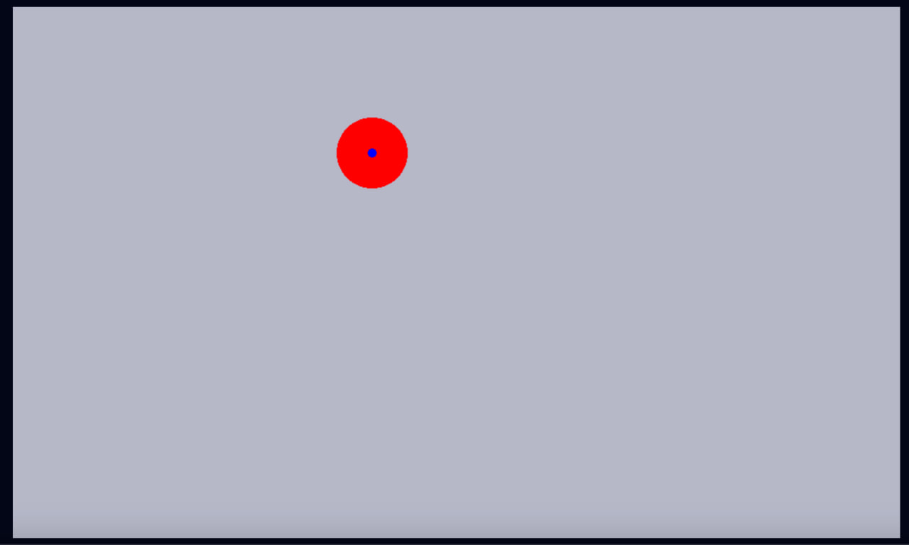

# Collision detection

A collision detection library implementation based on [https://www.jeffreythompson.org/collision-detection/](https://www.jeffreythompson.org/collision-detection/).

We are working with entities.

These entities can be of any of these types: Point, Line, Circle, Polygon.

Each entity has attributes, which can be mandatory or not:
- `id (unsigned int)`: unique identifier
- `shape (Shape)`: Point, Line, Circle, Polygon. To determine which collision algorithm to use
- `radius (float)`: in the case of a circle
- `speed (float)`: in case of movement
- `direction (Direction {x: float, y: float})`: in case of movement
- `category (Category)`: Player, Projectile, Obstacle. We use it to know when to check for collisions
- `vertices (array of Position {x: float, y: float})`: in case the entity is defined by points
- `position (Position {x: float, y: float})`: position of the entity on the map

For collision checking, we iterate through entities searching for those that collide with the current one and return a list of all collisions.

The possible collision detection algorithms we handle are:

- Point-Circle: Collision occurs when the distance between the center of the circle and the point is less than the radius of the circle




- Line-Circle: Collision occurs when the closest point on the line is inside the circle. It should be noted that when finding the nearest point, it should be within the segment.


- Circle-Circle: Collision occurs when the distance between the centers of the circles is less than the sum of the radius


- Circle-Polygon: Collision occurs when there is a collision between the circle and any of the segments of the polygon, or when the center of the circle is inside the polygon


There is a special case when a circle is inside a polygon, and there are two alternatives.

If you want to detect that collision, you should add this function call at the end of the `circle_polygon_collision`:
```
point_polygon_colision(circle, polygon)
```
If you only need to detect when a circle collides with the "walls" of the polygon, you should `return false`, and that's it.

It is necessary to clarify that there are other types of collisions that we do not need to implement at the moment, for example Polygon/Polygon.

