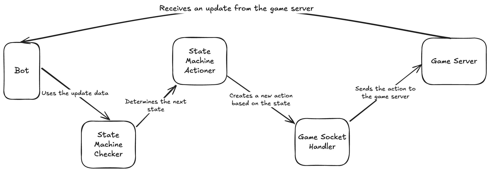
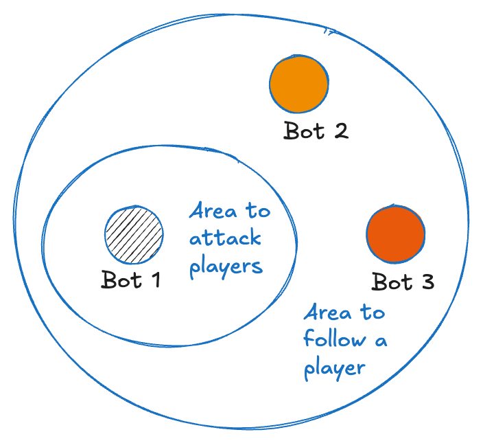
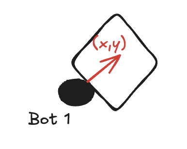
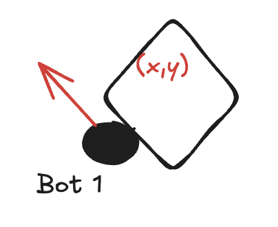
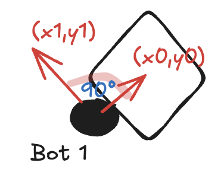

# Bots

## Bot's flow



## Bot's State Machine

### What is a State Machine?

A state machine is a computational model used to design and describe systems with a limited number of specific states and defined rules for transitioning between them.


### Bot's States

Our current bots can transition between four states: `idling, moving, attacking, and running_away`. At the moment, there are no restrictions between states; that is to say, bots can transition from any state to any other state. However, specific conditions must be met for transitions depending on the state.

#### Idling

This is the base state, bots start in this state and basically means that they're doing nothing and they will not be sending actions to the server.

#### Moving

This is the default state when anything else is being done, it will tell the bots to keep moving on the same direction that they were moving.
When walking, they will charge energy to use the basic attack.

#### Attacking

Bots will enter into the attacking mode if they have charged enough energy to use them. I'll explain how do they charge energy below:

- Charging energy for the Basic Skill
    They should traverse a certain amount of units to gain 1 cell to use the basic skill
- Charging energy for the Ultimate Skill
    They should've used the basic skill a certain amount of times, for instance, let's say 3.

This is just a gimmick added to prevent bots from using their shooting skills randomly and without purpose. 
When attacking, they will focus on the nearest player and won't consider health percentages or other factors, at least for now.

#### Tracking A Player

This state arises when the bot becomes bloodthirsty, and there are no nearby enemies that can be easily hit. The bot is more likely to start following enemies in order to catch and attack them!

Formally, for a bot to reach this state, players need to be near it but not close enough to be attacked.



#### Repositioning

Bots will enter this state if they are stuck in a position where they cannot move, causing them to change their walking destination.

#### Running Away

Bots will transition to this state whenever their health drops below a certain percentage. For now, this threshold is set at 40%. In this state, bots will attempt to escape from players by running in the opposite direction of the closest one. This does not necessarily mean they will run away from the player attacking them.


## Bot's gimmicks

### Skills 

As we said above, they use a mechanism of charging energy/cells before using an skill.


### Avoiding collisions

Since we don’t have a pathfinding solution yet, we need to implement a partial workaround to prevent bots from doing this.


They can't avoid obstacles, so if they're focusing on enemies or trying to move past an obstacle, they won't be able to because there's an obstacle between them and their objective.

In order to address this, we’ve come up with the following approach.

--- 

Let’s assume our bot is stuck in that position.



If we let time pass, we’ll realize that the bot is stuck in that position and isn’t moving. 
Using that as a trigger, we can change its direction.



Whenever we determine that our bot isn’t moving, we’ll switch its direction by either 90, 180, or 270 degrees. This isn’t a solution, but rather a temporary patch until we implement a pathfinder.




### Action blocking

This piece of code is located in apps/bot_manager/lib/game_socket_handler.ex. It may not be intuitive at first glance, but every time we send an action to the backend, we block the action from being sent until the specified time has passed. This can probably be removed, I think the only reason for this is to add some time to 'think' for the bots.

```elixir
  defp update_block_attack_state(%{current_action: %{action: {:use_skill, _, _}, sent: false}} = state) do
    Process.send_after(self(), :unblock_attack, Enum.random(500..1000))

    Map.put(state, :attack_blocked, true)
    |> Map.put(:current_action, Map.put(state.current_action, :sent, true))
  end

  defp update_block_attack_state(state), do: state
```
